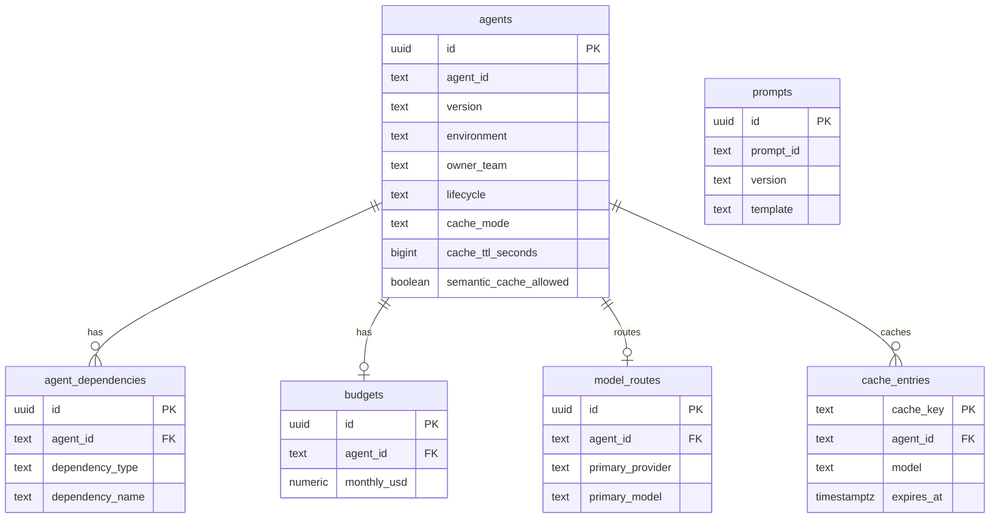

# PostgreSQL metadata schema

AgentVoir stores control-plane metadata in PostgreSQL. Migrations live in `db/migrations/postgres/`.

## Entity relationship diagram

## Tables

| Table | Purpose |
|-------|---------|
| `agents` | Registered enterprise agents with lifecycle and cache settings |
| `agent_dependencies` | Tools, APIs, vector stores, MCP servers, and agent dependencies |
| `prompts` | Versioned prompt templates |
| `model_routes` | Primary/fallback model routing per agent version |
| `budgets` | Monthly spend and per-request token limits |
| `cache_entries` | Optional metadata for cache entries (exact cache uses Redis in Phase 1) |

Usage events are stored in ClickHouse (`usage_events` table), not PostgreSQL.

Apply migrations with `make db-migrate` or automatically on registry-api startup when `POSTGRES_DSN` is set.

Seed demo agents with `./scripts/seed-demo.sh` after the onebox stack is running.
